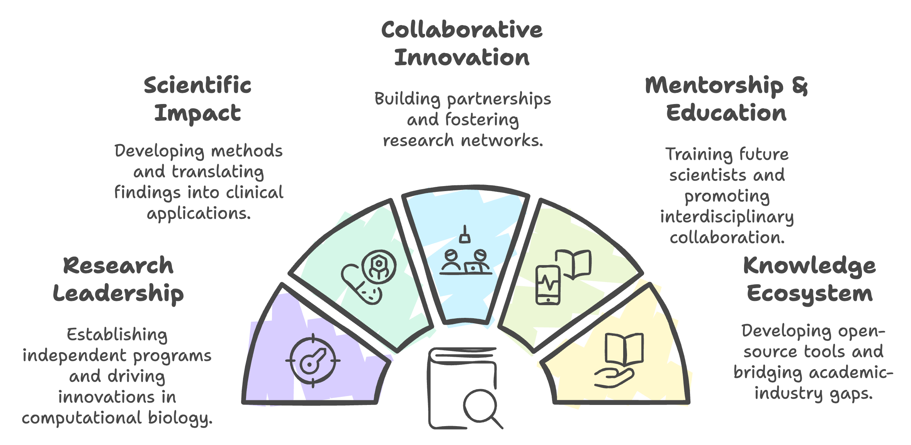

# About Me

As a computational biologist and machine learning researcher, I bridge the gap between complex biological questions and innovative computational solutions. My research combines advanced AI techniques with multi-omics analysis and protein design to drive discoveries in translational medicine.

## 🧬 Research Focus


#### 1. Computational Method Development
- **AI/ML in Biology**: Developing and applying novel machine learning approaches for biological data analysis
- **Single-Cell Tools**: Creating new computational methods for single-cell data interpretation
- **Protein Design**: Advancing tools for protein structure prediction and design
- **Multi-omics Integration**: Building frameworks for integrating diverse biological data types

#### 2. Biological Applications
- **Disease Mechanisms**: Investigating molecular mechanisms of inflammatory diseases
- **Drug Discovery**: Computational approaches for therapeutic development
- **Immunology**: Understanding immune cell dynamics and regulation
- **Biomarker Discovery**: Identifying and validating disease biomarkers

#### 3. Technical Development
- **Software Tools**: Building user-friendly bioinformatics tools
- **Pipeline Development**: Creating reproducible analysis workflows
- **Visualization Tools**: Developing interactive data visualization solutions
- **Cloud Computing**: Implementing scalable computational solutions


## 🔬 Technical Expertise

### Computational Skills
```python
skills = {
    'Programming': ['Python', 'R', 'Java', 'JavaScript', 'SQL', 'Bash'],
    'Machine Learning': ['TensorFlow', 'PyTorch', 'Scikit-learn', 'Deep Learning'],
    'Bioinformatics': ['Single-cell Analysis', 'NGS Analysis', 'Protein Structure Prediction'],
    'Cloud Computing': ['HPC Clusters', 'Cloud Platforms', 'Distributed Computing']
}
```

### Research Tools
- **Single-Cell Analysis**: Seurat, SCANPY, CellRanger, Monocle
- **Genomics**: GATK, SAMtools, BWA, STAR
- **Protein Structure**: AlphaFold, ESMFold, PyMOL, Chimera
- **Visualization**: ggplot2, Plotly, Seaborn, BioRender

## 🎯 Career Goals

My vision is to advance translational medicine through computational innovation. I aim to:



## 🏆 Selected Achievements

- **Publications**: 12+ peer-reviewed papers in leading journals
- **Teaching**: Developed graduate-level courses in molecular biology and bioinformatics
- **Leadership**: Mentored 7+ undergraduate researchers
- **Service**: Active reviewer for 15+ scientific journals
- **Recognition**: Multiple awards for research excellence